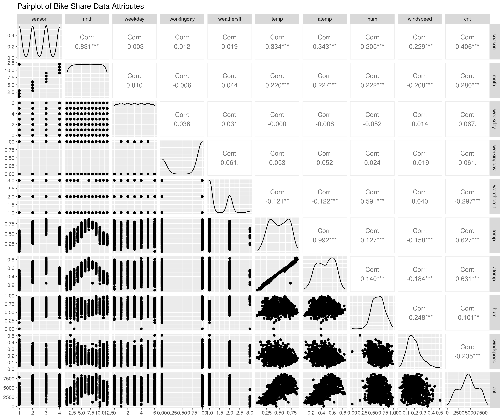

# Predicting Count of Total Rental Bikes Using KNN Regression
## "Authors: Cindy Jin, Linda Huang, Davis Li"

```{r setup, include = FALSE}
library(kknn)
library(tidyverse)
library(readxl)
library(digest)
library(repr)
library(tidymodels)
library(GGally)
options(repr.matrix.max.rows = 10)

set.seed(123)
```


## Summary
We are going to build a regression model using the k-nearest neighbors algorithm. We will use three features: wind speed, normalized feeling temperature and season to predict the count of total rental bikes. This model could help the bike-sharing companies to better understand the distribution of the need for bikes and encourage people to support public transportation. Our current model has a prediction error, as measured by root mean squared error (RMSE), of about 1483. While we can improve the model given that the count of total rental bikes in our data set range from 22 to 8714, and the median count of total rental bikes is 4548, the model is still useful.

The data we used to build our model contains all the daily counts of rental bikes between years 2011 and 2012 in Capital bikeshare system. The data was collected from https://archive.ics.uci.edu/ml/datasets/Bike+Sharing+Dataset.

## Introduction
Bike sharing is a top-rated service. When people need to commute short distances, they can rent a car directly from the bike-sharing system at any time without buying a bike so that they can travel conveniently. While users can either register to be premium customers, they can also rent bikes casually. However, for this particular service, the problem we should pay the most attention to is the supply of rental bikes. What if there is a high demand on a particular day but the rental bikes are out of supply? What if the bike-sharing company prepares too many bikes but there is a supply surplus? Therefore, our question is can we use some important factors to predict the number of count of total rental bikes including both casual and registered for a particular day?

In an attempt to answer this question, we used a K-nearest neighbors regression model and data from daily counts of rental bikes between years 2011 and 2012 in Capital bikeshare system to build a regression model. We found that our regression model had a prediction error of about 1483. While we can improve the model given that the count of total rental bikes in our data set range from 22 to 8714, and the median count of total rental bikes is 4548, the model is still useful.

## Methods
### Data
The data set used in this project has totally 16 columns, including the daily counts of rental bikes collected during 2011 and 2012 in Capital bikeshare system from https://archive.ics.uci.edu/ml/datasets/Bike+Sharing+Dataset. Based on the correlation of each factor with the daily counts of rental bikes, we chose to focus on 3 predictor variables(Table 1).

Table 1. Predictor variables used for analysis, chosen based on their high correlation with the response variable.


|Predictor variable|Description|
|---|---|
|season|season (1:winter, 2:spring, 3:summer, 4:fall)|
|windspeed|Normalized wind speed. The values are divided to 67 (max)|
|atemp|Normalized feeling temperature in Celsius. The values are derived via (t-t_min)/(t_max-t_min), t_min=-16, t_max=+50 (only in hourly scale)|


The data set is already clean, with no missing values. So we only needed to remove the unused columns.

### Analysis
A training set with 80% of the data and a test set with 20% of the data were created from the dataset. We used the ggpairs() function to show the correlations between daily count and all other variables in the dataset in order to find factors that are highly correlated with daily count for predictive modelling. Only three predictor variables were included in our regression model, and we removed variables with low correlations. We developed a regression model for forecasting the daily number of rental bikes using the KNN algorithm. Prior to modelling, all predictor variables were weighted equally. Using 5-fold cross-validation and the root mean squared error (RMSE) as the regression model metric, we chose the hyperparameter K.

Using the R programming language and the tidymodels and tidyverse R packages, we carried out the analysis. The code used for the analysis is available in this paper, which was created using Jupyter.    


### Result

First let's take a look at a preview of what the bike data looks like: 
``` {r read_data, echo = FALSE}
data_path = "../data/day.csv"
source("../src/read_data.R")
data <- read_data(data_path,c("instant", "dteday", "yr", "holiday", "casual", "registered"))     # read the data and unselect some useless columns
data_head <- head(data)         # print first few rows of the dataframe
knitr::kable(data_head, caption = "Preview of bike data")
```


```{r, echo = FALSE}
source("../src/summary_data.R")
# find the range and median of the daily count
max <- get_max(data, "cnt")
min <- get_min(data, "cnt")
med <- get_med(data, "cnt")

```

After exploring the data, the max of daily count (variable cnt) is `r max`, the min is `r min`, and the median is `r med`. 


Now, lets see if there are any missing values in the data! 

``` {r, echo = FALSE}
missing_values <- as.table(colSums(is.na(data)))
missing_values_df <- as.data.frame(missing_values)
names(missing_values_df) <- c("Variable", "Missing Values")
knitr::kable(missing_values_df, caption = "Missing values of bike data")
```

For the final part of our exploratory data analysis, lets explore the correlations between all factors in the graph below:

```{r, echo = FALSE, message = FALSE}

```

To start building the model, lets separate the data set into training set and test set

```{r, warning = FALSE, echo = FALSE, message = FALSE}
source("../src/split_data.R")
training <- split_data(data, 0.8, "train")
testing <- split_data(data, 0.8, "test")
```

- selected cnt as the target variable and windspeed&atemp&season as predictor variables,
- scaled and centered the predictor variables so that each variable is worth the same
```{r, echo = FALSE}
source("../src/find_k_min.R")
recipe = find_k_min(training)[[1]]
knn_spec = find_k_min(training)[[2]]
kmin = find_k_min(training)[[3]]
results = find_k_min(training)[[4]]
```

```{r, echo = FALSE}

```
```{r, echo = FALSE}
source("../src/prediction.R")
predicted_RMSE <- prediction(kmin,recipe,training,testing)
```

After visualizing the elbow plot, we found the kmin. Based on the kmin, the predicted RMSE (root mean squared error) is `r predicted_RMSE`.

## Discussion
We found that the predicted RMSE for our model was similar to the cross-validated RMSE. Our model has an RMSE of about `r round(predicted_RMSE, digits = 0)` and it provides bike-sharing companies with an estimate of how many rental bikes they should prepare for a particular day under certain weather conditions. But if we can have more data and explore the data deeper, we might be able to further improve our model.

## References
[1] https://www.sciencedirect.com/science/article/pii/S1877050919302364
[2] https://www.sciencedirect.com/science/article/pii/S2352146521001095
[3] https://www.atlantis-press.com/article/125947044.pdf
[4]https://www.google.com/url?sa=i&url=https%3A%2F%2Fwww.youtube.com%2Fwatch%3Fv%3DWkgKYjrNLwg&psig=AOvVaw2WXnvd_Ex_hbvoNQA7CcA8&ust=1671434938580000&source=images&cd=vfe&ved=0CBAQjRxqFwoTCOCGj8DSgvwCFQAAAAAdAAAAABAE
[5] https://www.tunneltime.io/en/seoul-korea/seoul-bike
